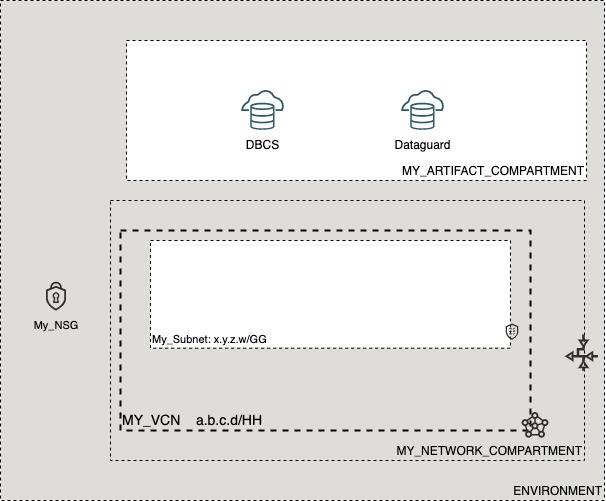

# OCI Cloud Bricks: Database Cloud Service (DBCS) Data Guard

[](https://img.shields.io/badge/license-UPL-green) [](https://sonarcloud.io/dashboard?id=oracle-devrel_terraform-oci-cloudbricks-dbcs-dataguard)

## Introduction
The following cloudbrick defines the creation of a DataGuard automatic deployment

## Reference Architecture
The following is the reference architecture associated to this brick



### Prerequisites
- Pre-created DBCS Database

## Sample tfvars file
´´´shell
########## PROVIDER SPECIFIC VARIABLES ##########
region           = "re-region-1"
tenancy_ocid     = "ocid1.tenancy.oc1..asdf"
user_ocid        = "ocid1.user.oc1..asdf"
fingerprint      = "qe:9e:13:cf:94:6e:2c:b9:54:d2:60:0d:e4:14:8b:5e"
private_key_path = "/home/opc/my_keys/oci_api_key.pem"
########## PROVIDER SPECIFIC VARIABLES ##########


########## ARTIFACT SPECIFIC VARIABLES ##########
dg_availability_domain_number = 1
network_subnet_name           = "My_Subnet"
primary_db_home_display_name  = "TestDBHome"
primary_database_name         = "TestDBSys"
database_admin_password       = "W3lC0m3_1#"
dg_hostname                   = "testdbhost-dg"
dg_shape                      = "VM.Standard2.2"
dg_display_name               = "TestDBSys-secondary"
dg_instance_compartment_name  = "MY_ARTIFACT_COMPARTMENT"
dg_network_compartment_name   = "MY_NETWORK_COMPARTMENT"
protection_mode               = "MAXIMUM_PERFORMANCE"
transport_type                = "ASYNC"
########## ARTIFACT SPECIFIC VARIABLES ##########
´´´
## Variable specific considerations
- Variable `primary_db_home_display_name` and `primary_database_name` should be exactly the same as primary db with no exception
- Above variables can not be bigger than 8 characters

## Sample provider

```shell
terraform {
  required_version = ">= 0.13.5"
}
provider "oci" {
  region       = var.region
  tenancy_ocid = var.tenancy_ocid
  user_ocid        = var.user_ocid
  fingerprint      = var.fingerprint
  private_key_path = var.private_key_path
  disable_auto_retries = "true"
}

provider "oci" {
  alias        = "home"
  region       = data.oci_identity_region_subscriptions.home_region_subscriptions.region_subscriptions[0].region_name
  tenancy_ocid = var.tenancy_ocid  
  user_ocid        = var.user_ocid
  fingerprint      = var.fingerprint
  private_key_path = var.private_key_path
  disable_auto_retries = "true"
}
```

## Variable documentation
## Requirements

| Name | Version |
|------|---------|
| <a name="requirement_terraform"></a> [terraform](#requirement\_terraform) | >= 0.13.5 |

## Providers

| Name | Version |
|------|---------|
| <a name="provider_oci"></a> [oci](#provider\_oci) | 4.44.0 |

## Modules

No modules.

## Resources

| Name | Type |
|------|------|
| [oci_database_data_guard_association.dataguard](https://registry.terraform.io/providers/hashicorp/oci/latest/docs/resources/database_data_guard_association) | resource |
| [oci_core_subnets.SUBNET](https://registry.terraform.io/providers/hashicorp/oci/latest/docs/data-sources/core_subnets) | data source |
| [oci_core_vcns.VCN](https://registry.terraform.io/providers/hashicorp/oci/latest/docs/data-sources/core_vcns) | data source |
| [oci_database_databases.DATABASES](https://registry.terraform.io/providers/hashicorp/oci/latest/docs/data-sources/database_databases) | data source |
| [oci_database_db_homes.DBHOMES](https://registry.terraform.io/providers/hashicorp/oci/latest/docs/data-sources/database_db_homes) | data source |
| [oci_database_db_systems.DBSYSTEMS](https://registry.terraform.io/providers/hashicorp/oci/latest/docs/data-sources/database_db_systems) | data source |
| [oci_identity_availability_domain.AD](https://registry.terraform.io/providers/hashicorp/oci/latest/docs/data-sources/identity_availability_domain) | data source |
| [oci_identity_compartments.COMPARTMENTS](https://registry.terraform.io/providers/hashicorp/oci/latest/docs/data-sources/identity_compartments) | data source |
| [oci_identity_compartments.NWCOMPARTMENTS](https://registry.terraform.io/providers/hashicorp/oci/latest/docs/data-sources/identity_compartments) | data source |

## Inputs

| Name | Description | Type | Default | Required |
|------|-------------|------|---------|:--------:|
| <a name="input_creation_type"></a> [creation\_type](#input\_creation\_type) | Specifies whether to create the peer database in an existing DB system or in a new DB system. | `string` | `"NewDbSystem"` | no |
| <a name="input_database_admin_password"></a> [database\_admin\_password](#input\_database\_admin\_password) | A strong password for the SYS, SYSTEM, and PDB Admin users to apply during standby creation. | `any` | n/a | yes |
| <a name="input_delete_standby_db_home_on_delete"></a> [delete\_standby\_db\_home\_on\_delete](#input\_delete\_standby\_db\_home\_on\_delete) | if set to true the destroy operation will destroy the standby dbHome/dbSystem that is referenced in the Data Guard Association. The Data Guard Association gets destroyed when standby dbHome/dbSystem is terminated. Only true is supported at this time. If you change an argument that is used during the delete operation you must run terraform apply first so that that the change in the value is registered in the statefile before running terraform destroy. terraform destroy only looks at what is currently on the statefile and ignores the terraform configuration files. | `bool` | `true` | no |
| <a name="input_dg_availability_domain_number"></a> [dg\_availability\_domain\_number](#input\_dg\_availability\_domain\_number) | Describes the Availability domain number where the primary DBCS is located at | `any` | n/a | yes |
| <a name="input_dg_display_name"></a> [dg\_display\_name](#input\_dg\_display\_name) | Display name of Dataguard DB Instance | `any` | n/a | yes |
| <a name="input_dg_hostname"></a> [dg\_hostname](#input\_dg\_hostname) | The hostname for the DB node. | `any` | n/a | yes |
| <a name="input_dg_instance_compartment_name"></a> [dg\_instance\_compartment\_name](#input\_dg\_instance\_compartment\_name) | Defines the compartment name where the infrastructure will be created | `any` | n/a | yes |
| <a name="input_dg_network_compartment_name"></a> [dg\_network\_compartment\_name](#input\_dg\_network\_compartment\_name) | Defines the compartment where the Network is currently located | `any` | n/a | yes |
| <a name="input_dg_shape"></a> [dg\_shape](#input\_dg\_shape) | he virtual machine DB system shape to launch for the standby database in the Data Guard association. The shape determines the number of CPU cores and the amount of memory available for the DB system. Only virtual machine shapes are valid options. If you do not supply this parameter, the default shape is the shape of the primary DB system. | `any` | n/a | yes |
| <a name="input_fingerprint"></a> [fingerprint](#input\_fingerprint) | API Key Fingerprint for user\_ocid derived from public API Key imported in OCI User config | `any` | n/a | yes |
| <a name="input_network_subnet_name"></a> [network\_subnet\_name](#input\_network\_subnet\_name) | Defines the subnet name associated to the artifact | `any` | n/a | yes |
| <a name="input_primary_database_name"></a> [primary\_database\_name](#input\_primary\_database\_name) | Name of the primary database to which this dataguard will be attached to | `any` | n/a | yes |
| <a name="input_primary_db_home_display_name"></a> [primary\_db\_home\_display\_name](#input\_primary\_db\_home\_display\_name) | Describes the user friendly display name of primary DB | `any` | n/a | yes |
| <a name="input_private_key_path"></a> [private\_key\_path](#input\_private\_key\_path) | Private Key Absolute path location where terraform is executed | `any` | n/a | yes |
| <a name="input_protection_mode"></a> [protection\_mode](#input\_protection\_mode) | The protection mode to set up between the primary and standby databases. For more information, see Oracle Data Guard Protection Modes in the Oracle Data Guard documentation. | `any` | n/a | yes |
| <a name="input_region"></a> [region](#input\_region) | Target region where artifacts are going to be created | `any` | n/a | yes |
| <a name="input_tenancy_ocid"></a> [tenancy\_ocid](#input\_tenancy\_ocid) | OCID of tenancy | `any` | n/a | yes |
| <a name="input_transport_type"></a> [transport\_type](#input\_transport\_type) | The redo transport type to use for this Data Guard association. Valid values depend on the specified protectionMode MAXIMUM\_AVAILABILITY - SYNC or FASTSYNC MAXIMUM\_PERFORMANCE - ASYNC MAXIMUM\_PROTECTION - SYNC | `any` | n/a | yes |
| <a name="input_user_ocid"></a> [user\_ocid](#input\_user\_ocid) | User OCID in tenancy | `any` | n/a | yes |

## Outputs

| Name | Description |
|------|-------------|
| <a name="output_Apply_Rate"></a> [Apply\_Rate](#output\_Apply\_Rate) | he rate at which redo logs are synced between the associated databases. Example: 180 Mb per second |
| <a name="output_Database_Peered_Ocid"></a> [Database\_Peered\_Ocid](#output\_Database\_Peered\_Ocid) | Returns de id of peered database created |
| <a name="output_Dataguard_Ocid"></a> [Dataguard\_Ocid](#output\_Dataguard\_Ocid) | Returns de id of dataguard |
| <a name="output_Peer_Role"></a> [Peer\_Role](#output\_Peer\_Role) | Returns de Peer Role configured |
| <a name="output_Protection_Mode"></a> [Protection\_Mode](#output\_Protection\_Mode) | Returns de protection mode of Dataguard Created |
| <a name="output_Role"></a> [Role](#output\_Role) | The role of the reporting database in this Data Guard association |
| <a name="output_dataguard_instance"></a> [dataguard\_instance](#output\_dataguard\_instance) | Dataguard Instance for integration purposes |

## Contributing
This project is open source.  Please submit your contributions by forking this repository and submitting a pull request!  Oracle appreciates any contributions that are made by the open source community.

## License
Copyright (c) 2021 Oracle and/or its affiliates.

Licensed under the Universal Permissive License (UPL), Version 1.0.

See [LICENSE](LICENSE) for more details.
